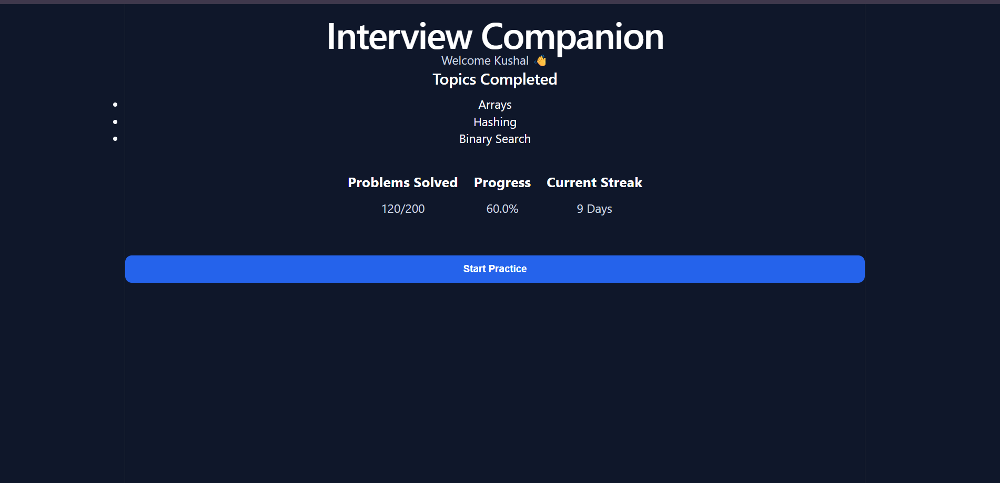
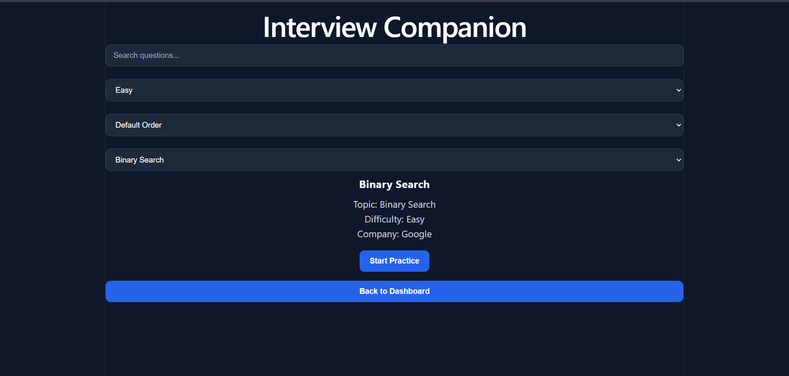

# 🚀 Interview Companion



A modern React-based coding interview preparation platform that helps users organize DSA practice, track progress, and build consistent problem-solving habits.

> 🚧 This project is actively under development and is planned to evolve into an AI-powered interview preparation platform.

---

## 🌐 Live Demo

Coming Soon (Vercel Deployment)

---

## ✨ Features

- 📊 Dashboard with progress tracking
- 🔍 Search questions instantly
- 🎯 Filter by difficulty
- 📚 Filter by topic
- ↕️ Sort by title, company, or difficulty
- ✅ Mark questions as solved
- 💾 Persistent progress using Local Storage
- 🛣️ Dynamic routing with React Router
- 🎨 Modern responsive UI

---

## 🛠️ Tech Stack

- React
- React Router
- JavaScript (ES6+)
- CSS
- Vite

---

## 📸 Screenshots

### 🏠 Dashboard


### 📚 Question Library


### 🔍 Search & Filters



### 📝 Question Details


---

## 🚀 Getting Started

```bash
git clone https://github.com/kushalchhandwal/interview-companion.git

cd interview-companion

npm install

npm run dev
```

---

## 💡 Vision

Interview Companion is being built as more than a question library.

The long-term goal is to provide an all-in-one platform where users can:

- Practice coding interview questions
- Track learning progress
- Receive AI-powered hints
- Write and run code in an online compiler
- Prepare for technical interviews from one place

---

## 🗺️ Roadmap

### Version 1 ✅
- React UI
- Search
- Filters
- Sorting
- Progress Tracking
- Local Storage

### Version 2
- Backend
- Database
- Larger Question Library

### Version 3
- Authentication
- User Profiles
- Cloud Sync

### Version 4
- Online Compiler
- Code Execution
- Test Cases

### Version 5
- AI Interview Assistant
- Code Explanations
- Personalized Recommendations

---

## 👨‍💻 Author

**Kushal Chhandwal**

GitHub: https://github.com/kushalchhandwal

---

⭐ If you like this project, consider starring the repository!